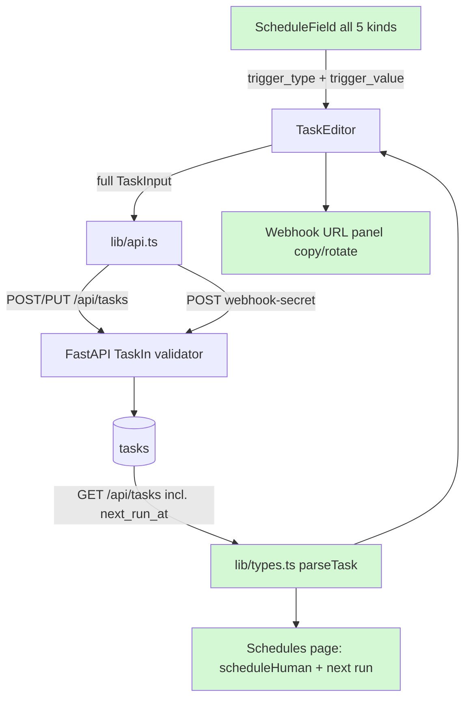

# 📋 Feature Plan — Frontend Scheduler Support  (NEW FEATURE)

**Project:** sparkclone (Astra) · **Date:** 2026-08-18 · **Status:** Draft — awaiting approval

## 1. Need & Goal

The backend now supports five schedule kinds (cron, interval, one-off date,
webhook, manual), retry policies, and next-run times — but the dashboard still
only knows cron. Users can't see or edit interval/one-off/webhook schedules
in the UI, can't find a task's webhook URL, and the backend currently has to
guess-and-preserve schedules when the old UI edits a task. This plan teaches
the frontend the full schedule model so everything the agent can create is
also visible and editable by hand.

## 2. Current State

The frontend is already professional in structure — typed parsers at the
network boundary (`lib/types.ts`), discriminated-union UI state, accessible
components, skeletons/empty states, and 20 Playwright specs. The gaps are
purely about the new scheduler model:

- `Task`/`TaskInput` carry only `cron`; the new fields (`trigger_type`,
  `trigger_value`, `max_retries`, `next_run_at`, `webhook_url`) are dropped
  by `parseTask` and never sent on save.
- `components/schedule-field.tsx` edits Manual / Daily / Weekly / Custom-cron
  only.
- `app/tasks/page.tsx` shows `cronHuman(t.cron)` (wrong for new kinds) and has
  no "next run" display; its `toggleEnabled` PUT omits the new fields.
- The backend defends against this UI with a preservation heuristic
  (legacy PUTs keep interval/date/webhook schedules); explicit frontend
  support supersedes it and finally lets users change those schedules.

## 3. Scope

**In scope:** types + API client for the new fields; schedule editor with all
five kinds; retry selector; webhook URL display/copy/rotate; next-run and
schedule display on the Schedules page; updated Playwright specs; one 1-line
backend validator relaxation (see §11 risk 2).
**Out of scope:** visual redesign (the UI language is fine), chat page changes,
per-task timezones, MCP/settings pages.

## 4. Assumptions

- The UI continues talking to the same task endpoints; no new backend routes.
- Interval is edited in minutes/hours in the UI, stored as seconds.
- One-off datetimes are entered in the user's local time via
  `<input type="datetime-local">` and sent WITH an explicit offset.
- Next.js is 16.3 (post-knowledge-cutoff): the guides under
  `frontend/node_modules/next/dist/docs/` are read before component work, per
  AGENTS.md.

## 5. Entry Criteria

- [ ] Plan approved
- [ ] Backend branch `feature/scheduler-agents` is the working base (its API
      provides the new fields)
- [ ] Existing Playwright suite green against the mock-LLM harness (verified
      at implementation start)
- [ ] Next 16.3 docs consulted for anything touched

## 6. Exit Criteria

- [ ] All five schedule kinds can be created, viewed, and edited in the UI
- [ ] Webhook tasks show a copyable URL and a working "rotate secret" action
- [ ] Schedules page shows a human schedule + next run time per task
- [ ] Pause/resume and rename never alter a task's schedule or retries
- [ ] Playwright specs updated and green; `npm run lint` and `tsc` clean

## 7. Requirements

- **FR-1:** `parseTask` narrows the new fields; `TaskInput` sends
  `trigger_type`, `trigger_value`, `max_retries` on create and update.
- **FR-2:** The schedule editor offers Manual / Daily / Weekly / Every-N
  (interval) / Once-at (date) / Webhook / Custom-cron, round-tripping any
  value the backend can store.
- **FR-3:** One-off datetimes include the user's UTC offset in the ISO string
  (a naive string would be treated as UTC by the backend and fire hours off).
- **FR-4:** Edit mode shows a webhook task's URL with copy-to-clipboard and a
  rotate button (`POST /api/tasks/{id}/webhook-secret`); create mode explains
  the URL appears after saving.
- **FR-5:** A retries selector (0–3) with a short explanation of backoff.
- **FR-6:** The Schedules list renders a human description for every kind
  ("Every 15 min", "Once on Aug 19, 9:00", "Webhook-triggered") plus
  "Next run in …" from `next_run_at` where present.
- **FR-7:** `toggleEnabled` (pause/resume) sends the complete task body so no
  field is silently reset.
- **NFR-1:** All new payload parsing follows the existing hand-rolled
  narrowing idiom in `lib/types.ts` — no new dependencies.
- **NFR-2:** No `any`, no non-null assertions; unions stay discriminated and
  exhaustively switched (house TypeScript rules).

## 8. Affected Files & Folder Structure Changes

```
frontend/
├── lib/
│   ├── types.ts               # MODIFIED — Task + parseTask: trigger_type,
│   │                          #   trigger_value, max_retries, next_run_at,
│   │                          #   webhook_url
│   ├── api.ts                 # MODIFIED — TaskInput fields; rotateWebhookSecret()
│   └── format.ts              # MODIFIED — cronHuman → scheduleHuman(task)
├── components/
│   ├── schedule-field.tsx     # MODIFIED — Schedule union grows (see below)
│   └── task-editor.tsx        # MODIFIED — retries selector; webhook URL panel
├── app/tasks/page.tsx         # MODIFIED — scheduleHuman + next run; full-body
│                              #   toggleEnabled
└── e2e/
    ├── editor.spec.ts         # MODIFIED — new schedule kinds
    └── schedules.spec.ts      # MODIFIED — list rendering for new kinds
app/api/tasks.py               # MODIFIED (1 line) — allow past run_at when
                               #   the task is disabled (see risk 2)
```

Schedule union, before → after:

```ts
// before
type Schedule =
  | { kind: "manual" } | { kind: "daily"; time: string }
  | { kind: "weekly"; time: string; days: string[] }
  | { kind: "custom"; cron: string };
// after — the field emits {trigger_type, trigger_value}, not a bare cron
type Schedule =
  | { kind: "manual" } | { kind: "daily"; time: string }
  | { kind: "weekly"; time: string; days: string[] }
  | { kind: "custom"; cron: string }
  | { kind: "interval"; minutes: number }
  | { kind: "once"; local: string }      // datetime-local value
  | { kind: "webhook" };
```

## 9. Architecture Flowchart (with feature highlighted)



**Legend:** green is new/changed. The schedule editor becomes the single
source of the trigger pair; the list page renders what the backend reports,
including the live `next_run_at`.

## 10. Implementation Phases

| Phase | Goal | Tasks | Files | Effort |
|---|---|---|---|---|
| 1 | Data layer | Extend `Task`, `parseTask`, `TaskInput`, add `rotateWebhookSecret`; `scheduleHuman` helper | lib/types.ts, lib/api.ts, lib/format.ts | S |
| 2 | Schedule editor | Grow the `Schedule` union + parse/emit for interval, once (with offset), webhook | components/schedule-field.tsx | M |
| 3 | Editor + list | Retries selector, webhook URL panel; list shows scheduleHuman + next run; full-body toggleEnabled | components/task-editor.tsx, app/tasks/page.tsx | M |
| 4 | Backend nicety | Allow past `run_at` when task disabled (so renaming a fired reminder doesn't 422) | app/api/tasks.py + backend test | S |
| 5 | Tests | Update/extend Playwright specs; lint + tsc + backend pytest green | frontend/e2e/, tests/ | M |

## 11. Risks & Rollback

| Risk | Mitigation |
|---|---|
| Naive datetime fires hours off for non-UTC users | FR-3: always append the local UTC offset before sending; Playwright asserts the payload |
| Editing a fired (disabled) one-off re-submits its past date → 422 | Phase 4: validator allows past dates when `enabled=false` (disabled tasks never schedule jobs) |
| Pause/resume drops new fields | FR-7 + spec covering toggle-then-reload field integrity |
| Next 16.3 API drift from training data | Read `node_modules/next/dist/docs/` guides first (AGENTS.md) |
| Spec churn breaks the existing 20 e2e tests | Run the suite before starting; update selectors alongside each phase |

**Rollback:** work continues on `feature/scheduler-agents` (same branch as the
backend feature it completes); abandoning the branch reverts everything.

## 12. Testing & Verification

- Playwright: create each schedule kind through the UI and assert the list row
  text and (via API) the stored `trigger_type`/`trigger_value`; webhook copy +
  rotate; pause/resume keeps `max_retries` and schedule intact; one-off input
  produces an offset-bearing ISO string.
- Backend pytest: new case for past `run_at` accepted when disabled.
- Manual: `npm run lint`, `npx tsc --noEmit`, and a live click-through against
  the real server with the mock LLM.

## 13. Beginner Notes

- **`datetime-local` input** — a browser field that gives back local time with
  no timezone; we must attach the offset ourselves before sending it.
- **Round-tripping** — the editor must parse any stored schedule back into its
  UI form so opening and saving without changes never alters the task.
- **Playwright** — the browser-automation test runner the project already uses
  for its end-to-end specs.
