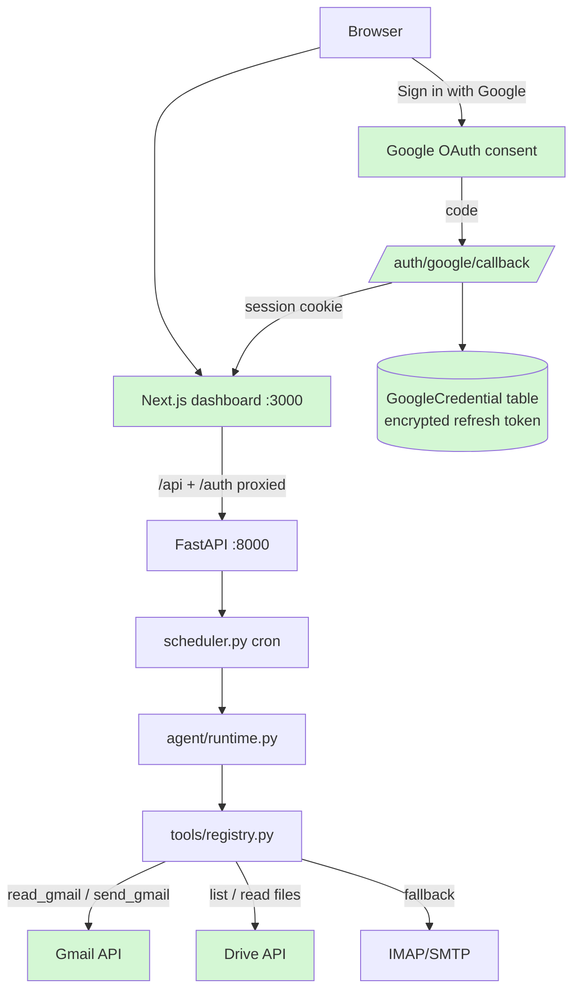

# 📋 Feature Plan — Google Sign-In (Gmail + Drive sync) & Next.js Dashboard  (NEW FEATURE)

**Project:** SparkClone · **Date:** 2026-08-11 · **Status:** Draft — awaiting approval

## 1. Need & Goal

Today SparkClone signs you in with a pasted token and reads email through IMAP with an
app password — clunky to set up and less secure. This feature adds **"Sign in with
Google"** (OAuth — a standard way to let Google prove who you are without sharing your
password), so the agent can read your **Gmail** and your **Google Drive** files using
tokens Google issues. At the same time, the hand-written single-page dashboard is
rebuilt in **Next.js** (a popular React framework) with a clean, professional look.

## 2. Current State

- **Backend:** FastAPI app (`app/main.py`) with CRUD APIs for skills, tasks, runs,
  approvals. Auth is a single shared bearer token (`SPARK_API_TOKEN`) checked on every
  request (`auth()` in `app/main.py:24`).
- **Email:** `read_inbox` uses IMAP + app password; `send_email` uses SMTP
  (`app/tools/registry.py:50-87`). No Drive access exists.
- **UI:** one static file, `web/index.html` (332 lines of vanilla HTML/JS) served at `/`.
- **DB:** SQLAlchemy models in `app/db.py` (Skill, Task, Run, Approval); SQLite by default.
- **Not a git repository yet** — no version history to roll back to.

## 3. Scope

**In scope:**
- Google OAuth 2.0 login flow (backend routes, token storage with refresh).
- New agent tools backed by Google APIs: Gmail read, Gmail send (approval-gated),
  Drive list/search, Drive file read.
- Session-based dashboard auth via Google login (the old bearer token stays as a
  fallback for scripts/API clients).
- New Next.js dashboard (tasks, skills, runs with live log, approvals, Google
  connection status) with a professional design; retire `web/index.html` at the end.

**Out of scope:** multi-user accounts, Drive file *writing/editing*, Google Calendar,
mobile app, deployment/HTTPS setup (README already notes reverse-proxy advice).

## 4. Assumptions

- "Google sync with mail and drive" means: you sign in with your Google account once,
  SparkClone stores an offline-access token, and the agent's tools use it for Gmail and
  Drive. The IMAP/SMTP tools remain but become the fallback when Google isn't connected.
- Single-user product stays single-user: exactly one Google account connected at a time.
- Next.js runs as a separate app (port 3000 in dev) talking to FastAPI (port 8000);
  FastAPI stays the single backend.
- You can create a (free) Google Cloud project to get OAuth credentials.

## 5. Entry Criteria

- [ ] Feature behavior agreed with user (this plan approved)
- [ ] Affected areas of codebase identified (see §8)
- [ ] `git init` + initial commit of current code, then working branch
      `feature/google-auth-nextjs` created (a branch is a safe copy to work on —
      the repo has no git history yet, so this is step zero)
- [ ] Google Cloud project created with OAuth consent screen (Testing mode) and a
      **Web application** OAuth client ID/secret; redirect URI
      `http://localhost:8000/auth/google/callback`; Gmail API + Drive API enabled
- [ ] App runs cleanly on current code (verified today: server boots, APIs respond)

## 6. Exit Criteria

- [ ] "Sign in with Google" from the new dashboard completes and shows the connected
      account's email address
- [ ] Agent task using `read_gmail` returns real inbox messages; `list_drive_files` and
      `read_drive_file` return real Drive content
- [ ] `send_gmail` pauses for approval before sending (same gate as today's `send_email`)
- [ ] All existing features (skills, tasks, cron runs, approvals, run log) work from the
      Next.js UI; old bearer-token API access still works
- [ ] New backend tests pass (OAuth callback, token refresh, tool fallbacks)
- [ ] README updated (Google setup steps, new dev commands); `web/index.html` removed

## 7. Requirements

**Functional**
- **FR-1:** `GET /auth/google/login` redirects to Google's consent screen requesting
  scopes `openid email`, `gmail.readonly`, `gmail.send`, `drive.readonly` with
  `access_type=offline` (so we get a refresh token).
- **FR-2:** `GET /auth/google/callback` exchanges the code for tokens, stores them in a
  new `GoogleCredential` table, and sets a signed session cookie for the dashboard.
- **FR-3:** Dashboard/API requests are authorized by *either* the session cookie *or*
  the existing `SPARK_API_TOKEN` bearer header.
- **FR-4:** New tools in `registry.py`: `read_gmail(limit, query)` (Gmail search syntax,
  e.g. `newer_than:7d`), `send_gmail(to, subject, body)` (requires_approval=True),
  `list_drive_files(query, limit)`, `read_drive_file(file_id)` (exports Google Docs as
  text; plain text/PDF-text for other files). All returned content wrapped in
  `<untrusted_content>` like existing tools.
- **FR-5:** Access tokens auto-refresh from the stored refresh token; if refresh fails,
  the tool returns a clear "reconnect Google" message instead of crashing the run.
- **FR-6:** `GET /auth/google/status` returns connected account + granted scopes;
  `POST /auth/google/disconnect` revokes and deletes stored tokens.
- **FR-7:** Next.js dashboard covers: login page, tasks list/create/edit/run-now,
  skills, run history with detail/transcript view (polling for live updates), approval
  queue with approve/deny, settings page showing Google connection.

**Non-functional**
- **NFR-1:** Refresh tokens are secrets: stored encrypted at rest (Fernet key from a new
  `SPARK_SECRET_KEY` env var) and never returned by any API response.
- **NFR-2:** Session cookie is `HttpOnly`, `SameSite=Lax`, signed with `SPARK_SECRET_KEY`.
- **NFR-3:** UI is responsive (usable on a laptop half-screen), consistent typography/
  spacing, dark-mode friendly — professional, not flashy.
- **NFR-4:** Existing API contracts unchanged so nothing scripted against them breaks.

## 8. Affected Files & Folder Structure Changes

```
sparkclone/
├── app/
│   ├── main.py                 # MODIFIED — mount auth router, CORS for :3000, dual auth (cookie OR bearer)
│   ├── config.py               # MODIFIED — GOOGLE_CLIENT_ID/SECRET, SPARK_SECRET_KEY, OAUTH_REDIRECT_URL
│   ├── db.py                   # MODIFIED — new GoogleCredential model (tokens, scopes, expiry, email)
│   ├── auth/
│   │   ├── __init__.py         # NEW
│   │   ├── google_oauth.py     # NEW — login/callback/status/disconnect routes, token exchange
│   │   ├── sessions.py         # NEW — signed session cookie issue/verify
│   │   └── crypto.py           # NEW — encrypt/decrypt refresh tokens (Fernet)
│   ├── google/
│   │   ├── __init__.py         # NEW
│   │   └── client.py           # NEW — builds Gmail/Drive API clients, auto-refresh logic
│   └── tools/
│       └── registry.py         # MODIFIED — add read_gmail, send_gmail, list_drive_files, read_drive_file
├── frontend/                   # NEW — Next.js app (TypeScript, App Router, Tailwind CSS)
│   ├── app/                    #   pages: login, tasks, skills, runs, approvals, settings
│   ├── components/             #   shared UI (nav, tables, run-log viewer, approval cards)
│   ├── lib/api.ts              #   typed fetch wrapper for the FastAPI backend
│   └── next.config.ts          #   dev proxy: /api/* and /auth/* → http://localhost:8000
├── web/index.html              # DELETED in final phase (kept until Next.js reaches parity)
├── requirements.txt            # MODIFIED — google-auth, google-auth-oauthlib,
│                               #   google-api-python-client, cryptography, itsdangerous
│                               #   (verify latest versions at install time)
├── docker-compose.yml          # MODIFIED — add frontend service (or serve exported build)
└── README.md                   # MODIFIED — Google Cloud setup walkthrough, new dev commands
```

## 9. Architecture Flowchart (new pieces highlighted)



**Legend:** Next.js dashboard — the new UI; FastAPI — existing backend; GoogleCredential —
new DB table holding tokens; Gmail/Drive API — Google's official APIs the new tools call;
IMAP/SMTP — today's email path, kept as fallback when Google isn't connected.

## 10. Implementation Phases

| Phase | Goal | Tasks | Files | Effort |
|---|---|---|---|---|
| 0 | Safe baseline | `git init`, commit, branch; add deps; `.env` keys | repo root, requirements.txt, .env.example | S |
| 1 | Google login works | OAuth routes, token exchange, encrypted storage, session cookie, dual auth, status/disconnect | app/auth/*, db.py, config.py, main.py | M |
| 2 | Gmail + Drive tools | google/client.py with auto-refresh; 4 new tools + registry entries; graceful "reconnect" errors | app/google/*, tools/registry.py | M |
| 3 | Next.js scaffold + parity | create-next-app (TS + Tailwind), API wrapper, port all existing screens (tasks/skills/runs/approvals), Google login button + settings | frontend/* | L |
| 4 | Polish + retire old UI | professional visual pass (layout, tables, empty/loading states, dark mode), delete web/index.html, docker-compose + README updates, tests | frontend/*, web/, README, docker-compose.yml | M |

Each phase ends runnable: after 1 you can sign in; after 2 a task can read Gmail/Drive;
after 3 the new UI is usable; after 4 it's the only UI.

## 11. Risks & Rollback

| Risk | Mitigation |
|---|---|
| Google consent screen in **Testing** mode: only listed test users can sign in, and external testing apps get refresh tokens that expire after ~7 days | Add your own Gmail as a test user; document the 7-day re-login quirk in README; fine for a single-user self-hosted tool |
| Gmail scopes are "restricted" — full verification needs a Google review | Not needed while in Testing mode with yourself as test user; noted in README |
| Refresh-token loss (Google only returns it on first consent) | Request `prompt=consent access_type=offline`; disconnect endpoint revokes so re-consent issues a fresh one |
| Two servers in dev (3000 + 3000→8000 proxy) confuses cookies/CORS | Proxy `/api` + `/auth` through Next.js so the browser sees one origin; CORS middleware as backup |
| UI rewrite breaks a workflow the old page supported | Keep `web/index.html` served at `/legacy` until Phase 4 parity check passes |

**Rollback:** every phase is a separate commit on `feature/google-auth-nextjs`; abandon
the branch (or `git revert` a phase) and `main` is untouched. The DB change is additive
(one new table), so old code still runs against the same database.

## 12. Testing & Verification

- **Automated (pytest + FastAPI TestClient):** callback exchanges a mocked code and
  stores an encrypted token; expired access token triggers refresh; tools return the
  "reconnect Google" message when no credential exists; dual auth accepts cookie or
  bearer and rejects neither.
- **Manual, mapped to exit criteria:** sign in with a real Google test account → status
  shows your email; create a task "read my last 5 emails and list my 5 newest Drive
  files" → run it → transcript shows real data; trigger `send_gmail` → approval card
  appears → approve → email arrives; click through every dashboard screen; then
  `curl -H "Authorization: Bearer …" /api/tasks` still works.

## 13. Beginner Notes

- **OAuth 2.0** — a protocol where you approve access on Google's own page; the app
  receives limited-power tokens instead of your password.
- **Refresh token / access token** — the access token works for ~1 hour; the refresh
  token lets the app silently get new ones. That's why we store it (encrypted).
- **Scopes** — the specific permissions requested (e.g. "read Gmail"); Google shows
  them on the consent screen.
- **Session cookie** — a small signed value your browser sends automatically so you
  stay logged in; `HttpOnly` means page JavaScript can't steal it.
- **Next.js / App Router** — a React framework with file-based pages and a built-in
  dev server; **Tailwind CSS** is a utility-class styling system we'll use for the
  professional look.
- **CORS / proxy** — browsers block calls between different origins (ports count);
  the Next.js dev proxy makes the frontend and backend look like one origin.
- **Fernet** — a simple symmetric encryption scheme (from the `cryptography` library)
  used to encrypt refresh tokens in the database.
