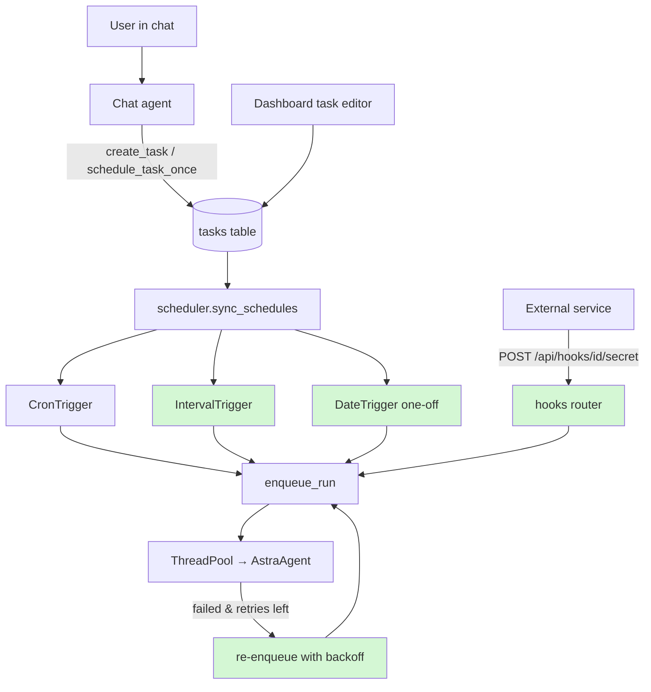

# 📋 Feature Plan — Agent-Centric Scheduler Enhancements  (NEW FEATURE)

**Project:** sparkclone (Astra) · **Date:** 2026-08-18 · **Status:** Implemented on feature/scheduler-agents

## 1. Need & Goal

Today Astra can only run a task on a cron schedule (a cron expression is a 5-field
text pattern like `0 9 * * MON` meaning "9:00 every Monday") or immediately on
demand. That misses the most natural agent requests: "remind me tomorrow at 9am"
(a one-off run), "check this every 15 minutes" (an interval), and "run this when
something happens outside the app" (an event/webhook trigger). The goal is to make
the scheduler understand all of these, let the chat agent create them
conversationally, and make schedules visible ("next run at …") and resilient
(missed fires don't vanish silently).

## 2. Current State

- `app/scheduler.py` — APScheduler `BackgroundScheduler` with only `CronTrigger`
  jobs; `sync_schedules()` reconciles jobs against `Task.cron`. A shared
  ThreadPool executes runs.
- `app/db.py` — `Task.cron` (string) is the only schedule field; empty = manual.
- `app/api/tasks.py` — `TaskIn` validates cron with `CronTrigger.from_crontab`
  and rejects everything else.
- `app/tools/management.py` — chat agent can `create_task` with cron or nothing.
- `app/agent/prompts.py` — CHAT_MODE teaches the agent cron syntax only.
- The README's "Extending" section already names webhook triggers as the intended
  next step ("add a webhook endpoint that calls `scheduler.enqueue_run`").
- No `next_run_time` is exposed anywhere; if the server is down when a job should
  fire, the run is silently skipped.

## 3. Scope

**In scope:** one-off (date) schedules, interval schedules, webhook/event
triggers with per-task secrets, next-run visibility in the API, misfire handling,
a `schedule_task_once` chat tool, and an opt-in per-task retry policy.
**Out of scope:** distributed workers / Redis queues (README defers this),
multi-user support, replacing APScheduler, per-task timezones (global `TZ` env
stays; noted as follow-up), and the `enabled` String→Boolean cleanup from the
earlier backend review (separate migration, don't couple it here).

## 4. Assumptions

- Single-process deployment stays (APScheduler in-process is fine).
- Schedule kind is stored on `Task` as `trigger_type` (`cron` | `interval` |
  `date` | `webhook` | `manual`) plus `trigger_value` (cron string, interval
  seconds, or ISO datetime) — one additive migration.
- Webhooks authenticate with a per-task random secret in the URL path, not the
  global API token (so third-party services never hold the dashboard token).
- The frontend Schedules page will consume `next_run_at` but frontend work is a
  follow-up, not part of this plan's exit criteria.

## 5. Entry Criteria

- [x] Feature behavior agreed with user (this plan approved)
- [x] Affected areas identified (see §8)
- [x] Existing behavior verified working (server starts, cron task fires)
- [x] Working branch created: `feature/scheduler-agents` (a branch is a safe
      copy of the code to work on)

## 6. Exit Criteria

- [x] All FRs below demonstrably work (see §12 for how each is verified)
- [x] Existing cron tasks keep firing unchanged after the migration
- [x] pytest tests added for trigger validation, webhook auth, and sync logic
- [x] README + CHAT_MODE prompt updated with the new schedule kinds

## 7. Requirements

- **FR-1:** A task can be scheduled to run once at a specific datetime
  (`trigger_type="date"`); after firing, it does not repeat.
- **FR-2:** A task can run on a fixed interval (e.g. every 15 minutes), with a
  minimum interval of 60 s to prevent runaway loops.
- **FR-3:** A task can be triggered by `POST /api/hooks/{task_id}/{secret}`;
  a wrong secret returns 404 (not 401, to avoid confirming the task exists).
- **FR-4:** `GET /api/tasks` includes `next_run_at` for every scheduled task.
- **FR-5:** The chat agent has a `schedule_task_once` tool ("remind me tomorrow
  at 9am") and `create_task` accepts interval/date schedules.
- **FR-6:** Jobs missed while the server was down fire once on startup if within
  a grace window (`misfire_grace_time=3600`, `coalesce=True`), instead of
  silently disappearing.
- **FR-7 (opt-in):** A task may set `max_retries` (0–3); a failed run re-enqueues
  with backoff up to that limit, and each retry is a visible Run row with
  `trigger="retry"`.
- **NFR-1:** All schedule input is validated at the API and tool layer; invalid
  input never reaches APScheduler.
- **NFR-2:** The migration is additive only; existing rows keep working with
  `trigger_type` defaulted from the current `cron` column.
- **NFR-3:** Webhook secrets are generated with `secrets.token_urlsafe` and are
  regenerable per task.

## 8. Affected Files & Folder Structure Changes

```
app/
├── db.py                  # MODIFIED — Task: trigger_type, trigger_value,
│                          #   webhook_secret, max_retries; additive migration
├── scheduler.py           # MODIFIED — sync_schedules builds Cron/Interval/Date
│                          #   triggers; misfire_grace_time; retry re-enqueue
├── api/
│   ├── tasks.py           # MODIFIED — TaskIn validates all trigger kinds;
│                          #   responses include next_run_at, webhook URL
│   └── hooks.py           # NEW — POST /api/hooks/{task_id}/{secret}
├── tools/management.py    # MODIFIED — schedule_task_once tool; create_task
│                          #   accepts interval/date
├── agent/prompts.py       # MODIFIED — CHAT_MODE documents the schedule kinds
└── main.py                # MODIFIED — register hooks router
tests/                     # NEW — test_scheduler.py, test_api_hooks.py,
                           #   test_trigger_validation.py
```

## 9. Architecture Flowchart (with feature highlighted)



**Legend:** green nodes are new. `sync_schedules` reconciles DB tasks into
APScheduler jobs of three trigger kinds; the hooks router is a fourth,
push-based path into the same `enqueue_run` funnel; retry re-enqueues a failed
run as a fresh Run row.

## 10. Implementation Phases

| Phase | Goal | Tasks | Files | Effort |
|---|---|---|---|---|
| 1 | Schema + trigger kinds fire | Add Task columns + additive migration; extend `sync_schedules` to build cron/interval/date triggers with misfire settings; one-off jobs auto-disable after firing | db.py, scheduler.py | M |
| 2 | API surface | Extend `TaskIn` validation per kind; return `next_run_at` + webhook URL; add hooks router with secret check; register in main.py | api/tasks.py, api/hooks.py, main.py | M |
| 3 | Agent tools | `schedule_task_once`; extend `create_task`/`update_task` for interval/date; teach CHAT_MODE the new kinds | tools/management.py, agent/prompts.py | S |
| 4 | Retry policy | `max_retries` column already added in P1; on `_fail`, re-enqueue with backoff and `trigger="retry"` | scheduler.py, agent/agent.py | S |
| 5 | Tests + docs | pytest for validation, sync reconciliation, hook auth; README + this plan checked off | tests/, README.md | M |

Each phase leaves the app runnable; cron-only behavior is preserved throughout.

## 11. Risks & Rollback

| Risk | Mitigation |
|---|---|
| Migration breaks existing tasks | Additive columns only; default `trigger_type` from existing `cron`; test against a copy of `spark.db` first |
| Webhook endpoint abused (spam runs) | Unguessable secret, 404 on mismatch, optional per-task rate cap (1 run/min) |
| Interval tasks flood the worker pool | 60 s minimum interval; pool already bounds concurrency at `WORKERS` |
| Retry loops burn LLM tokens | Hard cap `max_retries<=3`, exponential backoff, retries visible as Run rows |
| One-off jobs fire twice after restart | `coalesce=True` + disable task after the date job fires |

**Rollback:** work stays on `feature/scheduler-agents`; abandoning the branch
leaves main untouched. New DB columns are additive, so old code ignores them.

## 12. Testing & Verification

- **FR-1/2:** create date + interval tasks via API; assert APScheduler job type
  and `next_run_at`; fast-forward with a 60 s interval and see Run rows appear.
- **FR-3:** `curl` the hook with right/wrong secret → run enqueued / 404.
- **FR-4:** `GET /api/tasks` shows `next_run_at` matching `scheduler.get_jobs()`.
- **FR-5:** in chat, say "remind me in 2 minutes to X" → agent calls
  `schedule_task_once`, run fires.
- **FR-6:** stop server across a fire time, restart within an hour → exactly one
  coalesced run.
- **FR-7:** task with a failing prompt and `max_retries=2` → 3 Run rows total,
  last marked failed.
- Automated: pytest suite in `tests/` covers validation edges (bad cron, sub-60 s
  interval, past date), hook secret auth, and `sync_schedules` reconciliation.

## 13. Beginner Notes

- **APScheduler** — the Python library the project already uses to run jobs at
  scheduled times inside the server process.
- **Trigger** — APScheduler's word for "when should this fire": `CronTrigger`
  (calendar pattern), `IntervalTrigger` (every N seconds), `DateTrigger` (once,
  at a datetime).
- **Webhook** — a URL that an outside service calls to tell your app "something
  happened"; here it starts a task run.
- **Misfire / coalesce** — a "misfire" is a job whose scheduled moment passed
  while the app was down; `coalesce` means several missed fires collapse into
  one catch-up run.
- **Backoff** — waiting progressively longer between retries so a failing
  service isn't hammered.
