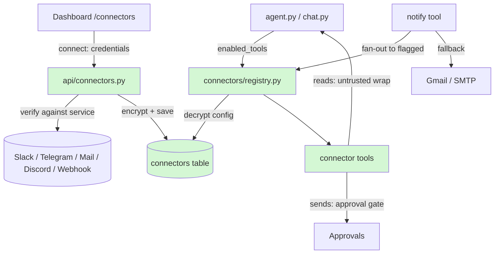

# 📋 Feature Plan — Connectors (Slack, Telegram, Mail, Discord, Webhook)  (NEW FEATURE)

**Project:** sparkclone (Astra) · **Date:** 2026-09-02 · **Status:** Implemented (backend, dashboard, tests, docs)

## 1. Need & Goal

Astra can talk to Gmail and Drive (via Google sign-in) and to any MCP server, but
nothing else. Users want the same "Connectors" experience Claude.ai offers: a
gallery of services (Slack, Telegram, Mail, Discord, …), a **Connect** button
that stores credentials safely, and — once connected — the agent gains that
service's tools and can deliver results there. The goal is a single Connectors
page in the dashboard, a small backend framework where each connector is one
file, and a `notify` tool that delivers to whichever connectors the user picks.

## 2. Current State

- `app/tools/registry.py` — a global `TOOLS` dict of built-in tools. Mail is
  env-only (`IMAP_*` / `SMTP_*` in `.env`) with two tools `read_inbox` and
  `send_email`. `notify` delivers by email only (Gmail → SMTP → stdout).
- `app/mcp/manager.py` + `app/api/mcp.py` — the only "connect a service"
  flow today. Secrets are Fernet-encrypted (Fernet is a symmetric encryption
  scheme) with the key derived from `SPARK_SECRET_KEY`. MCP tools are merged
  per run, never into the global registry, so config changes apply on the next
  run. This is the pattern to copy.
- `app/agent/agent.py`, `app/agent/chat.py`, `app/api/tools.py` — three places
  that assemble the tool list; all three must learn about connector tools.
- `frontend/app/apps/page.tsx` — the Gemini-Spark-style app gallery; MCP
  servers already appear as extra apps. `frontend/app/settings/page.tsx` hosts
  the Google card and MCP list.
- `frontend/e2e/apps.spec.ts` asserts the five built-in app names; don't rename.

## 3. Scope

**In scope:** a `Connector` table; a `app/connectors/` package with a base spec
and five connectors (Slack, Telegram, Mail via IMAP/SMTP, Discord, outbound
Webhook); REST API to list/connect/test/toggle/disconnect; connector tools
merged into task runs and chat; `notify` routing to chosen connectors; a
Connectors page in the dashboard with Google shown as a card; connected
connectors appearing as Apps; tests; README/.env docs.
**Out of scope:** OAuth apps for Slack/Discord (self-hosted single-user product:
bot tokens are the right shape), inbound Telegram/Slack chat with the agent
(a bot that answers messages — follow-up), multi-account per connector,
Notion/GitHub (easy to add later with the same framework).

## 4. Assumptions

- One connection per kind (like Claude.ai): `Connector.kind` is unique.
- Credentials are pasted by the user (bot token, app password); the backend
  verifies them against the real service before saving.
- Anything that **sends/posts** requires human approval; **reads** are ungated
  but wrapped as untrusted content. This matches the project's existing line.
- Mail connector config wins over `.env` `IMAP_*`/`SMTP_*`; env stays as a
  fallback so existing installs keep working.
- Work happens on the existing `feature/connectors-whatsapp-slack` branch; the
  rollback path is "delete the new files and revert the listed modified files".

## 5. Entry Criteria

- [x] Feature behavior agreed with user (request: "add the connector in slack and
      telegram and mail and others like claude implement")
- [x] Affected areas of codebase identified (see §8)
- [x] Existing tests pass on current code (94 passed; `tsc --noEmit` clean)
- [x] Working branch: `feature/connectors-whatsapp-slack`

## 6. Exit Criteria

- [x] Feature works per FR list below
- [x] Existing functionality unbroken (all 94 prior tests still pass)
- [x] New tests added (`tests/test_connectors.py` — 28 tests, 122 total)
- [x] `npx tsc --noEmit` and `npm run lint` clean in `frontend/`
- [x] `ruff check app tests/test_connectors.py` clean
- [x] README + `.env.example` updated to point at Connectors

## 7. Requirements

- **FR-1:** `GET /api/connectors` lists every connector kind with its fields,
  connection status, verified identity (e.g. bot name), enabled flag, notify
  flag, and tool names — never secret values.
- **FR-2:** `POST /api/connectors/{kind}` verifies the credentials against the
  service and saves them encrypted; a blank secret field on re-save keeps the
  stored value.
- **FR-3:** `POST …/toggle`, `POST …/notify`, `POST …/test`, `DELETE …/{kind}`
  manage a connection.
- **FR-4:** Enabled connectors' tools are callable in task runs (respecting
  `allowed_tools`) and in chat; disabled/disconnected ones vanish on the next run.
- **FR-5:** `notify(message, subject, channel="auto")` delivers to every
  connector flagged as a notify channel **and** the existing email chain
  (Gmail → SMTP), falling back to stdout when nothing is configured.
  `channel="email"` uses only the email chain; `channel=<kind>` targets one
  connected connector even when it is not flagged. Stays ungated: it reaches
  only the user's own destinations.
- **FR-6:** Slack: list channels, read channel history, post message (approval).
  Telegram: read recent bot updates, send message (approval). Mail: read inbox,
  send email (approval). Discord: read channel, post message (approval).
  Webhook: POST JSON to a fixed URL (approval).
- **FR-7:** Dashboard: `/connectors` gallery with connect dialog, status, tools,
  toggles, disconnect; sidebar entry; connected connectors appear on Apps.
- **NFR-1:** Secrets encrypted at rest with the existing Fernet helper and never
  returned by any endpoint.
- **NFR-2:** All service reads wrapped in `<untrusted_content>`.
- **NFR-3:** Tool names match `^[a-zA-Z0-9_-]{1,64}$` (provider constraint).
- **NFR-4:** Python 3.10 compatible; no new Python dependencies (httpx, imaplib,
  smtplib already available).

## 8. Affected Files & Folder Structure Changes

```
app/
├── db.py                        # MODIFIED — new Connector table
├── main.py                      # MODIFIED — include connectors router
├── connectors/                  # NEW — one file per service
│   ├── __init__.py
│   ├── base.py                  # ConnectorSpec / Field dataclasses, helpers
│   ├── registry.py              # SPECS map, load/save config, enabled tools, notify fan-out
│   ├── slack.py                 # Slack Web API (bot token)
│   ├── telegram.py              # Telegram Bot API
│   ├── mail.py                  # IMAP/SMTP (moved from tools/registry.py)
│   ├── discord.py               # Discord REST (bot token)
│   └── webhook.py               # outbound HTTP POST
├── api/
│   ├── connectors.py            # NEW — REST endpoints
│   └── tools.py                 # MODIFIED — list connector tools
├── agent/
│   ├── agent.py                 # MODIFIED — merge connector tools per run
│   ├── chat.py                  # MODIFIED — merge connector tools per turn
│   └── prompts.py               # MODIFIED — mention connector tools / notify
└── tools/registry.py            # MODIFIED — mail tools delegate to connector; notify fan-out
frontend/
├── app/connectors/page.tsx      # NEW — gallery page
├── components/connector-card.tsx    # NEW — card + status
├── components/connector-dialog.tsx  # NEW — connect/edit form
├── components/sidebar.tsx       # MODIFIED — nav entry
├── components/icons.tsx         # MODIFIED — slack/telegram/discord/webhook icons
├── app/apps/page.tsx            # MODIFIED — connected connectors as apps
├── app/settings/page.tsx        # MODIFIED — Google card moves to Connectors; link
└── lib/api.ts                   # MODIFIED — connector API + parsers
tests/test_connectors.py         # NEW
README.md, .env.example          # MODIFIED — docs
```

## 9. Architecture Flowchart (with feature highlighted)


**Legend:** the API verifies and stores credentials; the registry is the only
reader of stored credentials and hands ready-to-call tools to the agent loops;
sends pass through the existing approvals queue; `notify` fans out to every
connector the user flagged.

## 10. Implementation Phases

| Phase | Goal | Tasks | Files | Effort |
|---|---|---|---|---|
| 1 | Framework | Connector table, base spec, registry, API, wire into agent/chat/tools list | db.py, connectors/{base,registry}.py, api/connectors.py, main.py, agent.py, chat.py, api/tools.py | M |
| 2 | Core connectors | Slack, Telegram, Mail (move IMAP/SMTP), notify fan-out | connectors/{slack,telegram,mail}.py, tools/registry.py, prompts.py | M |
| 3 | Tests | API + gating + notify + secret-leak tests | tests/test_connectors.py | S |
| 4 | Dashboard | api.ts, connectors page, card, dialog, sidebar, icons, Apps, Settings | frontend/* | M |
| 5 | Extras + docs | Discord, Webhook, README, .env.example | connectors/{discord,webhook}.py, docs | S |

## 11. Risks & Rollback

| Risk | Mitigation |
|---|---|
| Telegram bot cannot message a user who never messaged it | Verify with `getMe`; if chat_id is blank, discover it from `getUpdates`; field hint tells the user to message the bot first |
| Slack bot token missing scopes | Verify with `auth.test`; hint lists `chat:write`, `channels:read`, `channels:history` |
| Secret leakage via API | Only `has_value` booleans leave the server; test asserts no token substring in any response |
| Existing `.env` mail users break | Mail tools fall back to env when no connector row exists |
| Prompt injection via service content | Every read wrapped in `UNTRUSTED_WRAP`, same as email/web today |

**Rollback:** delete `app/connectors/`, `app/api/connectors.py`,
`frontend/app/connectors/`, the two new components, and the test file; revert
the modified files listed in §8. The `connectors` table can stay (unused) or be
dropped.

## 12. Testing & Verification

- Automated: `.venv/bin/python -m pytest -q` — new tests cover connect (verify
  mocked), secret non-leak, blank-secret re-save, toggle/disconnect, tool
  merging into a run's tool list, approval gating on sends, notify fan-out.
- Frontend: `npx tsc --noEmit` and `npm run lint`.
- Manual: open `/connectors`, connect Telegram with a real bot token, click
  Test, then in Chat say "send me a hello on Telegram" and approve the request.

## 13. Beginner Notes

- **Connector** — a saved connection to an outside service (credentials plus
  the tools the agent gets from it).
- **Bot token** — a secret string a service (Slack, Telegram, Discord) issues to
  a bot account; it works like a password for API calls.
- **IMAP / SMTP** — the standard protocols for reading (IMAP) and sending
  (SMTP) email; Gmail needs an "App Password" for them.
- **Fernet** — the encryption used to store secrets so the database file alone
  cannot reveal them.
- **Untrusted content wrap** — external text is fenced so the agent treats it
  as data and never as instructions (prompt-injection defense).
- **Approval gate** — the run pauses until you click Approve in the dashboard
  before any message is actually sent.

## 14. Implementation Notes (post-build)

- **Spec dispatch through the module.** `ConnectorSpec` holds its connector
  module and calls `module.verify` / `module.send` at call time rather than
  capturing bound functions. Captured references cannot be patched, and the
  first test run reached the real Slack API because of it.
- **Mail keeps the built-in tool names.** `read_inbox` and `send_email` stay
  the single registered built-ins and delegate to the Mail connector config,
  falling back to `IMAP_*`/`SMTP_*`. `enabled_tools()` skips any connector tool
  whose name is already a built-in, so the model never sees duplicate names.
- **Token scrubbing.** Telegram puts the bot token in the request URL, so every
  connector HTTP failure passes through `scrub()` before surfacing. A test
  asserts a failed verify leaks nothing.
- **Per-run merging.** Connector tools are bound per run and per chat turn,
  exactly like MCP tools, so pausing or disconnecting takes effect on the next
  run without a restart.
