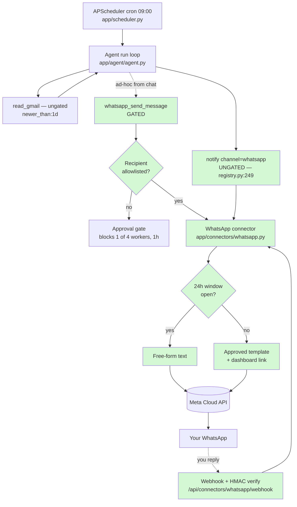

# 📋 Feature Plan — WhatsApp + Slack Connectors (inbox digest → WhatsApp)

**Project:** Astra (sparkclone) · **Date:** 2026-08-26 · **Status:** Draft — awaiting approval

## 1. Need & Goal

Astra already reads your Gmail and sends email, but the only way it reaches you is
email itself. You want it to reach you where you actually look — **WhatsApp** — and
you want connectors that feel like Claude connectors: connect once, and the agent
simply *has* new tools.

Concrete goal: a scheduled task that every morning reads your mail, summarizes it,
and delivers the digest to your WhatsApp. Slack is the second connector on the same
plumbing — it is far simpler, and it proves the design is generic rather than
WhatsApp-specific.

## 2. Current State

**Connectors today — two mechanisms, no shared abstraction:**

| | MCP servers | Google |
|---|---|---|
| Config | DB rows (`mcp_servers`), added at runtime | `.env` OAuth client + one DB row |
| Secret | `env_enc` (Fernet) | `refresh_token_enc` (Fernet) |
| Tools | discovered, `mcp_<server>_<tool>` | hand-registered in `registry.py` |
| Gating | per **server** flag | per **tool** `requires_approval=True` |

**Facts that shape this plan (all verified in the code):**

- **Tools are dead simple to add.** `app/tools/registry.py:34-40` — a `Tool` dataclass
  (`name, description, input_schema, fn, requires_approval`) where `fn` is a plain sync
  function returning `str`, plus a module-level `register(Tool(...))` call. No decorator,
  no discovery. `README.md:135` documents exactly this. New tools appear automatically
  in `GET /api/tools` and the dashboard tool picker.
- **`notify` is the only unattended-safe delivery primitive** (`registry.py:249-262`,
  registered `:392`). It is deliberately **ungated** — the code comment says why:
  *"it sends only to the user's own NOTIFY_EMAIL, so it stays ungated (unlike
  send_gmail/send_email)"*. Chain: connected Gmail → SMTP → stdout. **This is the hook
  the WhatsApp digest must use.**
- **Mail reading is already solved and ungated:** `read_gmail` (Gmail search syntax) and
  `read_inbox` (IMAP), both wrapping output in `UNTRUSTED_WRAP` (`registry.py:27-31`).
  The seeded `daily-briefing` skill already does `read_gmail is:unread newer_than:1d`
  → `notify`.
- **A gated tool in a scheduled run is a trap** (`app/agent/agent.py:131-155`): it sets
  the run to `waiting_approval`, **blocks one of only 4 worker threads for 1 hour**,
  then times out as **`denied`** (`decision` is initialised to `"denied"`), tells the
  model the user refused, and the run typically ends **`succeeded` with nothing
  delivered and no failure notification**. See R-1.
- **The Apps page has no Connect button.** `frontend/app/apps/page.tsx:28-81` is a
  hardcoded `BUILTIN_APPS` gallery of automation *templates* (gmail, drive, youtube,
  web, python), each `{key, name, icon, desc, tools[], template}`. **Connecting happens
  on the Settings page** — `frontend/app/settings/page.tsx:144-208` `GoogleCard`, which
  polls status every 8 s and connects by full-page navigation to `/auth/google/login`.
- **OAuth template:** `app/auth/google_oauth.py` — but it hardcodes one provider
  (module-level `SCOPES`, `AUTH_URL`, `GoogleCredential`). Reusable as-is:
  `crypto.make_state` / `check_state` (`app/auth/crypto.py:40-58`, HMAC + 600 s TTL).
  `settings.oauth_redirect_url` is a single scalar already taken by Google.
- **Encryption:** `app/auth/crypto.py:24-37`, Fernet keyed off SHA-256 of
  `SPARK_SECRET_KEY`; `decrypt` returns `None` rather than raising.
- **Reusable rate limiter:** `app/agent/rate_limiter.py` — thread-safe sliding window,
  currently used only by the LLM path. Its docstring states the house rule: *"Every
  outbound call to a rate-limited service goes through acquire()."*
- **Proxy:** `frontend/next.config.ts:8-14` rewrites `/api/*` and `/auth/*` to the
  backend — a new OAuth callback must live under one of those prefixes.
- **No WhatsApp or Twilio code exists anywhere** (grep across the tree: zero files).
- Scheduling needs no new code: `app/scheduler.py` already does cron with a 1-hour
  misfire grace and `coalesce=True`.

## 3. Scope

**In scope**
- A generic connector layer (`app/connectors/`) with Fernet-encrypted credential storage.
- **WhatsApp connector** — outbound send (Meta WhatsApp Cloud API), inbound webhook,
  24-hour-window handling.
- **Slack connector** — OAuth install, `slack_send_message`, `slack_list_channels`.
- **`notify` gains a `channel` argument** so scheduled digests reach WhatsApp ungated.
- Settings-page connect cards, Apps-page templates, `.env` settings, a seeded
  "Inbox digest → WhatsApp" skill.

**Out of scope**
- Two-way WhatsApp *conversation* with Astra (inbound only records the message and
  re-opens the window; chatting over WhatsApp is a follow-up).
- Slack slash-commands / Events API subscriptions.
- Unofficial WhatsApp libraries (`whatsapp-web.js`, Baileys) — they violate WhatsApp's
  ToS and risk a permanent number ban. Not used.
- Fixing MCP's missing auth-header support (a remote MCP server needing a bearer token
  can't be connected today) — noted, not in this change.

## 4. Assumptions

1. **WhatsApp provider = Meta WhatsApp Cloud API** (official, free tier, no middleman),
   behind a small provider interface so Twilio can be added later without touching the tool.
2. You will create a Meta Business account + WhatsApp Business phone number; your
   personal number is the single allowed recipient.
3. **"All my mails"** = received in the last 24 hours in the already-connected Gmail
   account — not the whole mailbox.
4. Slack = one workspace, bot token, posting to a channel or DM.
5. Graph API version is config (`WHATSAPP_GRAPH_VERSION`, default `v22.0`) —
   **verify the current version** when building.

## 5. Entry Criteria

- [ ] Plan approved
- [ ] Meta Business account + WhatsApp Business phone number created; your number added
      as a test recipient
- [ ] Permanent access token + phone-number-ID obtained
- [ ] Slack app created (or Slack deferred to Phase 7)
- [ ] Existing tests pass on a clean baseline (`pytest`)
- [ ] Branch created: `feature/connectors-whatsapp-slack`

## 6. Exit Criteria

- [ ] Settings page shows **WhatsApp** and **Slack** cards with live status +
      Connect/Disconnect, matching `GoogleCard`
- [ ] Apps page gains WhatsApp/Slack automation templates
- [ ] Agent gains `whatsapp_send_message`, `slack_send_message`, `slack_list_channels`
      (visible in `GET /api/tools` and the task tool picker)
- [ ] `notify(channel="whatsapp")` delivers and stays **ungated**
- [ ] A cron task produces an inbox digest that arrives on WhatsApp **unattended** —
      verified by leaving it alone, not by "Run now"
- [ ] Sending to a non-allowlisted number still opens an approval gate
- [ ] Credentials Fernet-encrypted at rest; no token in any API response or log line
- [ ] New tests pass; old tests unbroken; README + `.env.example` updated

## 7. Requirements

**Functional**
- **FR-1:** `GET /api/connectors` returns `{name, connected, hint}` per connector;
  `POST /api/connectors/whatsapp/connect` stores encrypted credentials;
  `POST /api/connectors/{name}/disconnect` deletes them.
- **FR-2:** `whatsapp_send_message(to, text)` sends a free-form message when the
  24-hour window is open.
- **FR-3:** When the window is **closed**, the connector falls back to a pre-approved
  **template** (one-line summary + link to the dashboard run) — WhatsApp forbids
  free-form business-initiated messages outside the window.
- **FR-4:** Template parameters are sanitized — newlines, tabs and runs of >4 spaces
  collapsed to single spaces — or Meta rejects the send with
  *"Param text cannot have new-line/tab characters or more than 4 consecutive spaces"*.
- **FR-5:** `POST /api/connectors/whatsapp/webhook` answers Meta's `hub.challenge`
  handshake, verifies the `X-Hub-Signature-256` HMAC, records inbound messages, and
  sets `window_open_until = now + 24h`.
- **FR-6:** Slack OAuth install (`/auth/slack/login` → `/auth/slack/callback`, reusing
  `make_state`/`check_state`) stores the bot token; `slack_send_message(channel, text)`
  posts via `chat.postMessage`; `slack_list_channels()` lists channels.
- **FR-7:** **`notify(message, subject, channel="auto")`** — `"email" | "whatsapp" |
  "slack" | "auto"`, default from `NOTIFY_CHANNEL`. Stays **ungated**, keeps its
  fixed-recipient design. This is what makes the unattended digest work. The seeded
  skill calls `notify`, never the raw send tool.
- **FR-8:** `whatsapp_send_message` / `slack_send_message` are `requires_approval=True`
  (arbitrary recipient), with a bypass when the recipient is on
  `WHATSAPP_ALLOWED_RECIPIENTS` / `SLACK_ALLOWED_CHANNELS`.
- **FR-9:** A seeded skill `inbox-digest-whatsapp` following the existing house
  structure (*Use when… / Steps naming exact tools / Output / Guardrails*), capping the
  digest at ~1200 chars, top 5 items, sender + one line on why it matters.
- **FR-10:** Inbound WhatsApp/Slack bodies are wrapped with the existing
  `UNTRUSTED_WRAP` (`registry.py:27-31`) before they can enter agent context.

**Non-functional**
- **NFR-1:** Tokens encrypted via `app/auth/crypto.py`; API returns only
  `connected: bool` + a masked hint, mirroring `has_env` in `app/api/mcp.py:31`.
- **NFR-2:** Outbound calls use `httpx` (already the only HTTP dep) with a timeout,
  following `app/google/client.py:30-31`, and go through a `RateLimiter` instance per
  the house rule in `app/agent/rate_limiter.py`.
- **NFR-3:** An unconfigured connector must not break startup or the tool list — it
  returns a guidance **string** rather than raising, exactly like
  `app/google/client.py`'s `RECONNECT_MSG` pattern.
- **NFR-4:** No connector call may block a worker thread the way an approval does —
  HTTP timeouts in seconds, never minutes.

## 8. Affected Files & Folder Structure Changes

```
app/
├── connectors/                  # NEW — the generic connector layer
│   ├── __init__.py              # NEW — registry: name → connector object
│   ├── base.py                  # NEW — Connector protocol: status/connect/disconnect
│   ├── store.py                 # NEW — encrypted get/set (wraps auth/crypto.py)
│   ├── whatsapp.py              # NEW — Cloud API: send text, send template,
│   │                            #       window tracking, param sanitizer
│   └── slack.py                 # NEW — OAuth exchange + chat.postMessage
├── api/
│   └── connectors.py            # NEW — /api/connectors + WhatsApp webhook
├── auth/
│   └── slack_oauth.py           # NEW — /auth/slack/* modelled on google_oauth.py,
│                                #       reusing make_state/check_state
├── tools/
│   ├── messaging.py             # NEW — whatsapp_send_message, slack_send_message,
│   │                            #       slack_list_channels + allowlist bypass
│   └── registry.py              # MODIFIED — register the three tools; extend `notify`
│                                #   (:249-262) with `channel`; keep it ungated
├── notifications.py             # MODIFIED — route failure/approval notices by channel
├── db.py                        # MODIFIED — ConnectorCredential model + migration in
│                                #   BOTH _migrate_sqlite AND _migrate_postgres (R-5)
├── config.py                    # MODIFIED — WhatsApp/Slack/NOTIFY_CHANNEL settings
└── main.py                      # MODIFIED — include connectors + slack routers

frontend/
├── app/settings/page.tsx        # MODIFIED — SECTIONS entry + WhatsAppCard/SlackCard
│                                #   cloned from GoogleCard (:144-208)
├── components/connector-card.tsx# NEW — generic status/connect/disconnect card
├── components/icons.tsx         # MODIFIED — add whatsapp + slack SVG paths to PATHS
├── app/apps/page.tsx            # MODIFIED — add templates to BUILTIN_APPS (:28)
├── components/agent-tools.tsx   # MODIFIED — displayName() handles non-MCP sources
├── lib/api.ts                   # MODIFIED — connector endpoints + parseX validators
└── e2e/apps.spec.ts             # MODIFIED — visible-app assertion list

scripts/seed_skills.py           # MODIFIED — add the inbox-digest-whatsapp skill
tests/test_connectors.py         # NEW — sanitizer, window fallback, allowlist, HMAC
tests/test_registry.py           # MODIFIED — extend test_sensitive_tools_are_approval_gated
.env.example / README.md         # MODIFIED — new settings + setup steps
```

## 9. Architecture Flowchart



**Legend** — green = new. The scheduled path (cron → `read_gmail` → `notify`) is
entirely ungated, so it completes unattended. The gated `whatsapp_send_message` exists
for ad-hoc chat use with an arbitrary recipient. The connector picks free-form vs
template based on whether you have messaged the business number in the last 24 hours;
your reply hits the webhook, which re-opens that window.

## 10. Implementation Phases

| Phase | Goal | Tasks | Files | Effort |
|---|---|---|---|---|
| **1. Foundation** | Credentials stored and read securely | Fix `_migrate_postgres` (R-5), `ConnectorCredential` model, `store.py`, `base.py`, config settings + `.env.example` | `app/db.py`, `app/connectors/*`, `app/config.py` | M |
| **2. WhatsApp send** | A message reaches your phone from a Python shell | Cloud API client, template sender, param sanitizer, window state, rate limiter | `app/connectors/whatsapp.py` | M |
| **3. notify channel** | The unattended digest path works | Extend `notify` with `channel`, wire WhatsApp, **keep ungated** | `app/tools/registry.py`, `app/notifications.py` | S |
| **4. Gated tool** | Ad-hoc sends from chat | `whatsapp_send_message` + allowlist bypass, `register(Tool(...))` | `app/tools/messaging.py`, `app/tools/registry.py` | S |
| **5. API + UI** | Connect/disconnect from Settings | `/api/connectors` router, generic card, icons, Apps template | `app/api/connectors.py`, `frontend/app/settings/page.tsx`, `frontend/components/connector-card.tsx`, `icons.tsx`, `apps/page.tsx` | M |
| **6. Webhook** | Inbound replies open the window | `hub.challenge` + HMAC verify, store inbound, untrusted wrap; `ngrok` for local testing | `app/api/connectors.py`, `app/connectors/whatsapp.py` | S |
| **7. Slack** | Second connector on the same rails | `slack_oauth.py`, `chat.postMessage`, channel list, card | `app/auth/slack_oauth.py`, `app/connectors/slack.py`, `app/tools/messaging.py` | M |
| **8. The digest** | End goal working unattended | Seed the skill, create the cron task, tune output to the 1024-char template limit | `scripts/seed_skills.py`, dashboard | S |
| **9. Harden** | Tests, docs, secrets hygiene | unit tests, README, `.env.example`, e2e assertion | `tests/*`, docs | M |

Phases 1–4 alone deliver the actual goal (digest → WhatsApp). 5–9 are the
connector-polish and second-connector work.

## 11. Risks & Rollback

| Risk | Mitigation |
|---|---|
| **R-1 — A gated send silently swallows the digest.** Verified: an approval in a scheduled run holds 1 of 4 worker threads for **1 hour**, times out as **denied**, the model is told the user refused, and the run finishes **`succeeded`** — nothing sent, no failure notice. | The scheduled path uses the **ungated `notify`** (FR-7), never the gated tool. Allowlist bypass (FR-8) covers ad-hoc sends. Add the currently-missing test for the `_approved()` timeout while here. |
| **R-2 — The 24h window blocks the morning digest.** WhatsApp forbids free-form business-initiated messages outside the window, so a plain send fails exactly when you need it. | Register the template in Phase 2 — Meta review takes hours to days, so start it early. Template = one-line summary + link to the full digest in the dashboard. |
| **R-3 — Template parameters reject newlines/tabs/>4 spaces.** A multi-line digest pasted into a param errors out. | Sanitizer (FR-4) written and unit-tested before the tool ships; the full multi-line digest only ever goes down the free-form path. |
| **R-4 — Meta onboarding is slow** (business verification, template review). | Phases 7–8 are independent — do them while waiting. A Twilio sandbox backend drops in behind the same interface if Meta stalls. |
| **R-5 — The Postgres migration path is already broken.** `_migrate_postgres` (`app/db.py:229`) doesn't add new columns the way `_migrate_sqlite` does, so a new table/column lands only on SQLite. It is also why the app currently only starts on SQLite. | Fix it as the first task of Phase 1. |
| **R-6 — Secrets leak** into logs or GET responses. | Encrypt at rest; return only `connected` + a masked hint (copy the `has_env` pattern, `app/api/mcp.py:31`); add a test asserting no token appears in any response body. |
| **R-7 — Prompt drift.** `app/agent/prompts.py:30-41` hardcodes per-tool guidance; a new send tool with a length limit will be misused without a line there. | Add one line to `CORE` about WhatsApp length/format limits in Phase 4. |

**Rollback:** all work lives on `feature/connectors-whatsapp-slack`; abandon the branch
and `main` is untouched. Connectors are additive — with no credentials stored, the tools
degrade to a guidance string (NFR-3) and Astra behaves exactly as it does today.

## 12. Testing & Verification

**Automated** — `tests/test_connectors.py`, following `tests/conftest.py` (temp SQLite
via `DATABASE_URL` set *before* app import) and the stubbing style of
`tests/test_agent_loop.py` (`patch("app.agent.agent.providers.complete", ...)`, fake
tools injected into the live `TOOLS` dict and deleted on teardown):

| Test | Requirement |
|---|---|
| sanitizer strips newlines/tabs/long space runs | FR-4 |
| window closed → template path; window open → free-form | FR-2 / FR-3 |
| `notify(channel="whatsapp")` is **not** approval-gated (extend `test_sensitive_tools_are_approval_gated` in `tests/test_registry.py`) | FR-7 |
| allowlisted recipient skips approval; other recipient creates an `Approval` row | FR-8 |
| webhook rejects a bad `X-Hub-Signature-256`, accepts a good one | FR-5 |
| `GET /api/connectors` body contains no raw token | NFR-1 |
| unconfigured connector returns a guidance string, never raises | NFR-3 |

**Manual, end to end:**
1. Start the app — `uvicorn app.main:app --port 8000` and `npm run dev` in `frontend/`.
   *(Note: today the backend only starts on SQLite — see R-5.)*
2. Settings → **Connect WhatsApp**, paste phone-number-ID + token → card shows Connected.
3. Chat: *"send a WhatsApp to \<your number\> saying hello"* → message arrives.
4. Message the business number from your phone (via an `ngrok` tunnel to the webhook) →
   confirm it was logged and the window opened.
5. Create the task from the seeded skill, hit **Run now**, watch the transcript in
   **Runs**, confirm the digest lands on WhatsApp.
6. Set the task a couple of minutes ahead, **walk away**, and confirm the unattended fire
   also delivers. This is the real exit criterion — step 5 cannot catch the R-1 failure
   mode, because a human is standing there to approve.
7. Repeat 3–5 for Slack.

## 13. Beginner Notes

- **Connector** — a stored set of credentials plus the tools they unlock. Astra has one
  today (Google); this adds two more.
- **24-hour customer service window** — WhatsApp only lets a business send free-form
  messages within 24 hours of the user's last message. Outside it, only pre-approved
  **templates** are allowed. This single rule drives most of the design.
- **Message template** — a fixed sentence with `{{1}}`-style blanks, reviewed and
  approved by Meta before you may use it.
- **Approval gate** — Astra pauses and waits for you to click Approve before doing
  something sensitive. Fine when you're watching; a trap at 9 a.m. when you're not.
- **Webhook** — a URL on your server that WhatsApp calls when something happens (someone
  replied). It must be reachable from the internet — use **ngrok** (a tunnel that gives
  your laptop a temporary public URL) during development.
- **HMAC signature** — a cryptographic stamp Meta puts on each webhook so you can prove
  the request really came from them.
- **Fernet** — the encryption scheme this project already uses for stored tokens.
- **APScheduler** — the library that runs your tasks on a clock.

**Sources for the WhatsApp rules:**
[24-hour window & templates (Meta)](https://developers.facebook.com/documentation/business-messaging/whatsapp/messages/send-messages) ·
[Template parameter formatting limits](https://developers.facebook.com/docs/whatsapp/message-templates/creation/) ·
[Cloud API message endpoint](https://developers.facebook.com/documentation/business-messaging/whatsapp/reference/whatsapp-business-phone-number/message-api)
